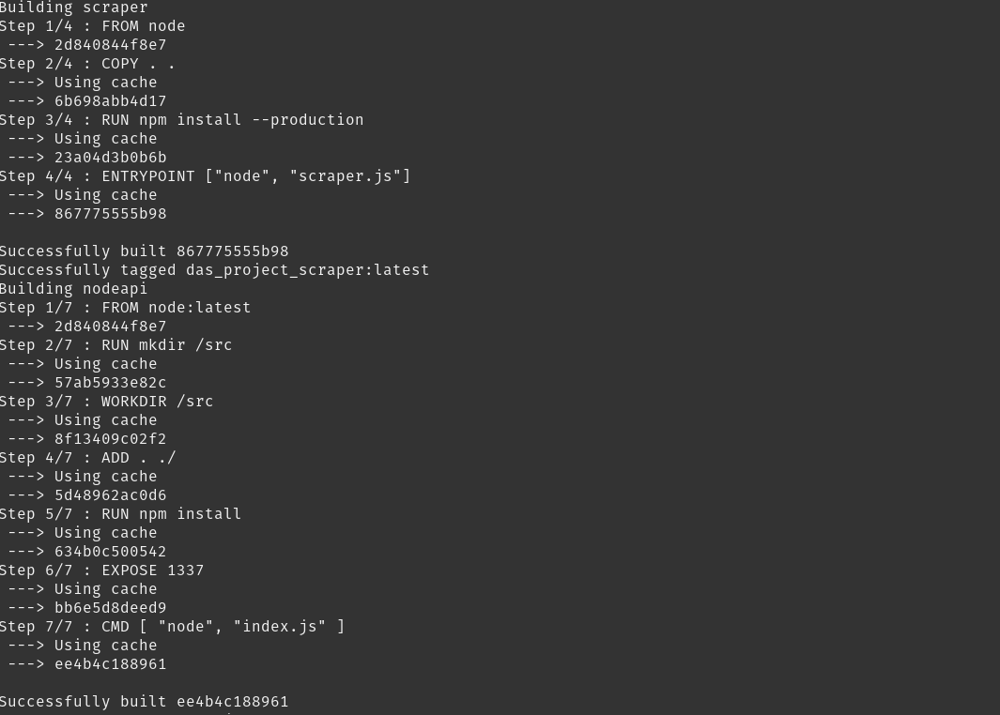
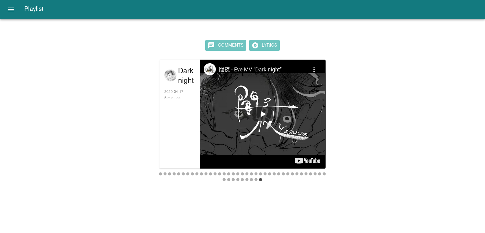
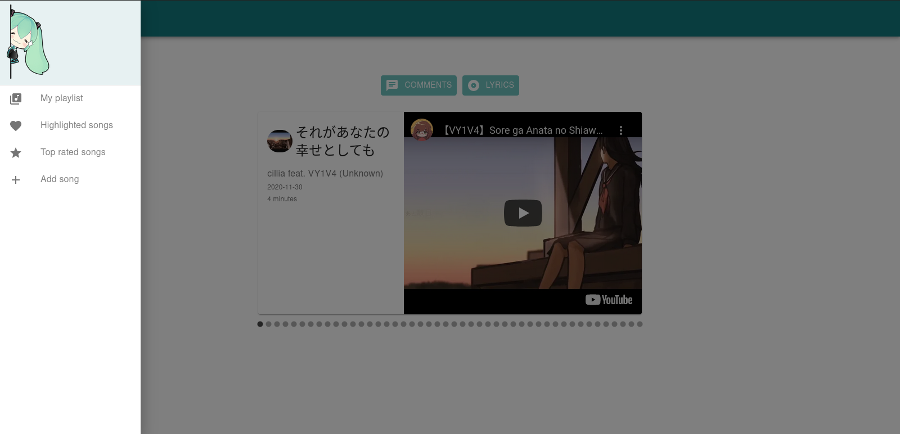
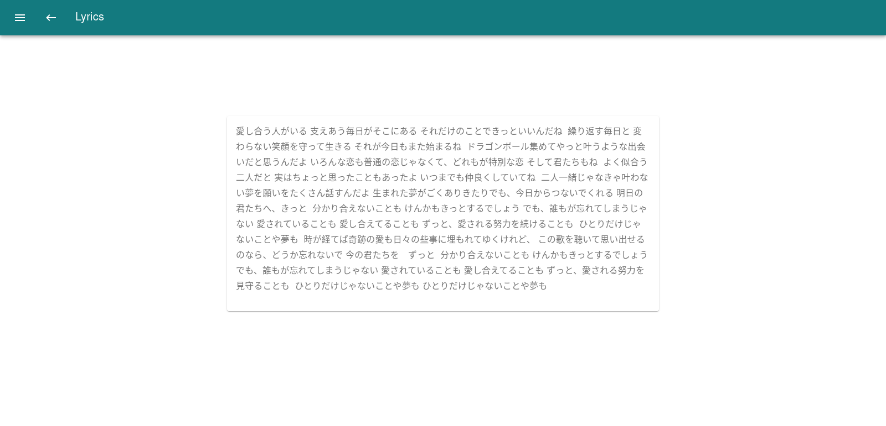
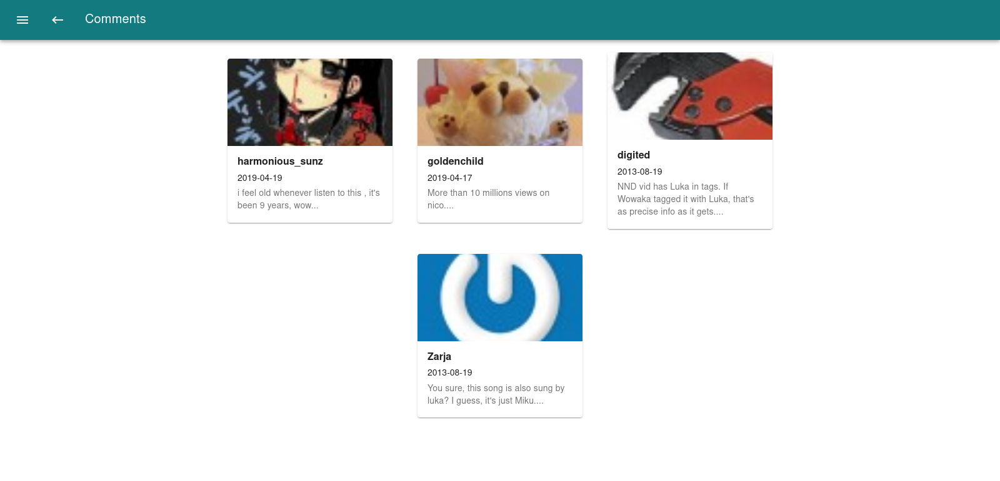
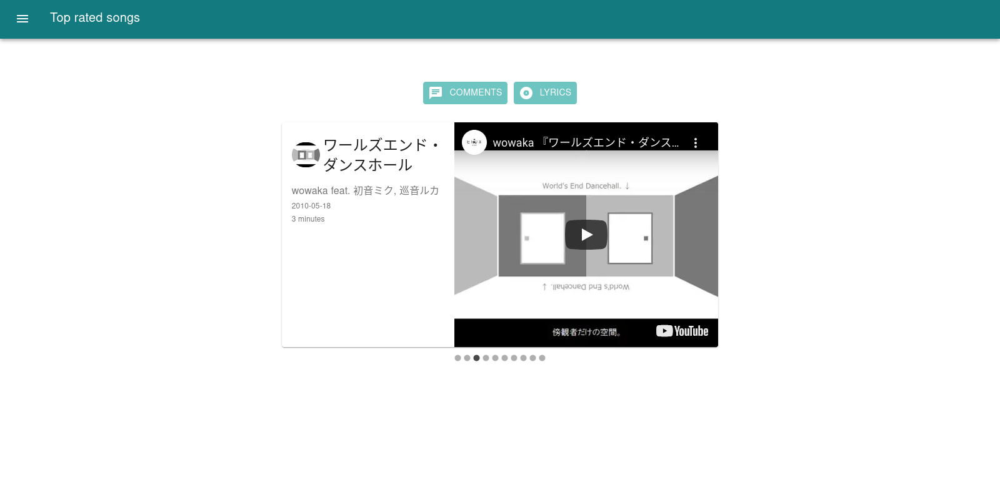

# [DAS_project](https://github.com/developer-jesus-github/DAS_project)
Repositorio para el proyecto final de la materia Diseño y Arqitectura de Software.

## MATERIA
Diseño y Arquitectura de Software.

## Profesor
Angel Santiago Jaime Zavala.

## Equipo
- David Aguirre Juárez
- Jesús "V̶O̶N̶" Ángel Rodríguez Martínez
- Diego Rodríguez Martínez

## Prerequisitos
- Docker
- DockerCompose

## Tecnologías
Para el desarrollo principal de este proyecto utilizamos el MERN STACK:
- Mongo (Database)
- Express (Backend)
- ReactJS (Frontend)
- NodeJS (Backend)
Además de las siguientes tecnologías:
- MongoExpress (DBMS)
- MaterialUI (UI Framework based in Material Design)
- Diagrams (Python library to track the architecture diagrams)
Para el tema de orquestadores y contenedores utilizamos:
- Docker
- DockerCompose

### Arquitectura
La arquitectura establecida fue la de microservicios contando con un total de 6 servicios distribuidos en diferentes contenedores.
- ***Contenedor A***: Contiene una imagen funcional de **MongoDB**  
Lleva el nombre de *"mongo"*
- ***Contenedor B***: Contiene una imagen funcional de **MongoExpress**  
Lleva el nombre de *"mongo-express"*
- ***Contenedor C***: Contiene un scrapper hecho en NodeJS que se encarga de traer los datos de [Vocadb](https://vocadb.net/swagger/ui/index) e ingresarlos a la base de datos.  
Lleva el nombre de *"scrapper"*
- ***Contenedor D***: Contiene una imagen de NodeJS y Express que servirá como API para lograr la comunicación y manejo de peticiones.
Lleva el nombre de *"nodeapi"*
- ***Contenedor E***: Contiene una imagen funcional de **rabbitmq**.
Lleva el nombre de *"rabbitmq"*
- ***Contenedor F***: Contiene una imagen funcional de **apache** que servirá como servidor web para alojar
un sitio web generado con el build de ReactJS.
Lleva el nombre de *"apache"*

## Instrucciones para correr los contenedores
1. Clonar el repositorio.
2. Entrar a la carpeta del repositorio.
3. En caso de tener contenedores corriendo, asegurarte de que todos los contenedores están detenidos.
<code>$ sudo docker stop $(sudo docker ps -q -a)</code>
4.- Asegurarte de que todos los puertos necesarios para correr los contenedores estén disponibles.
5.- Como paso opcional puedes eliminar todas las imagenes para que no causen ningún tipo de conflicto.
<code>$ docker system prune --all</code>
6.- Corre el orquestador.
<code>$ sudo docker-compose up --build</code>
> Nota: Una vez que esté corriendo podremos ver en consola lo que esta pasando.

## Instrucciones para acceder a los servicios
1.- El servicio de MongoDB corre en el puerto *27017*.
2.- El servicio web de MongoExpress corre en http://localhost:8081.
<code>usuario: DAS</code>  
<code>contraseña: sistemas</code>
3.- El servicio de NodeJS y Express (API) corre en http://localhost:1337.
4.- El servicio de RabbitMQ corre en el puerto *15672* además también corre en http://localhost:15672.
5.- El servicio de Apache que contiene el build de ReactJS corre en http://localhost

## Recorrido por la página web de ReactJS

Este servicio se basa en mostrarte un conjunto de canciones permitiendo ver los comentarios que otra gente haya registrado, ver la letra de la canción (siempre y cuando estos datos estén disponibles) y reproducir el vídeo, 
además de mostrarte información relacionada a la misma.

También podrás registrar tus propias canciones, por defecto el formulario ya cuenta con información
base para que la demostración sea más rápida.

Para comprobar que tu canción se ha registrado con éxito sólo debes volver a la categoría playlist y ver 
la última canción que se ha insertado en el panel inferior.

Además contamos con dos secciones extra, la categoría de destacados y la de más puntuadas.

Si la canción cuenta con su letra también podrás verla (siempre y cuando sepas japonés).

Del mismo modo que si la canción cuenta con comentarios podrás leerlos.

En caso de querer probar el botón de letra o comentarios tendrás
que tener en cuenta que no todas las canciones tienen esta información ya que se basa en su popularidad.

Como recomendación personal te sugiero entrar a la categoría de más puntuadas y luego buscar las siguientes dos canciones basado en el panel inferior para que puedas ver esta información.

Cuenta con letras.

Cuenta con comentarios.

## Diagramas de Arquitectura
Para poder generar nuestro diagrama de arquitectura utilizamos la herramienta de [mingrammer](https://diagrams.mingrammer.com/)
Para correr el script es necesario instalar diagrams para python y graphviz:  
<code>$ sudo apt install graphviz</code>  
<code>$ sudo pip3 install diagrams</code>  
El script llamado diagramas.py  de la carpeta diagramas se encarga de generar el esquema de arquitectura:  
<code>$ python3 diagramas.py</code>  
Mientras que para generar nuestro diagrama de base de datos usamos una herramienta online.
Estos archivos los podras encontrar en la carpeta llamada  <code>diagramas</code>.

## Extras
En la carpeta <code>contenedor-f</code> encontrarás otro README con detalles técnicos de ReactJS.

## Agradecimientos
- Al profesor Angel Santiago Jaime Zavala por ser el mejor maestro de la escuela BY FAR.
- Al equipo de Emilio Barrera y Fernando Gonzalez por permitirme tomar su README.md porque saben lo cansados que estamos para escribir uno desde 0, thx so much, se merecen el cielo LOL.
- Al anime porque todos en este equipo somos altos OTAKUS LMAO re facheros los panas.

## To-dos
- Agregar más endpoints.
- Configurar apache para que se lleve mejor con ReactRouter (temas de SPA que no permiten navegar de buena manera en apache a menos que se configure este).
- Refactorizar código.
- Dormir un día entero porque andamos cansados LOL.